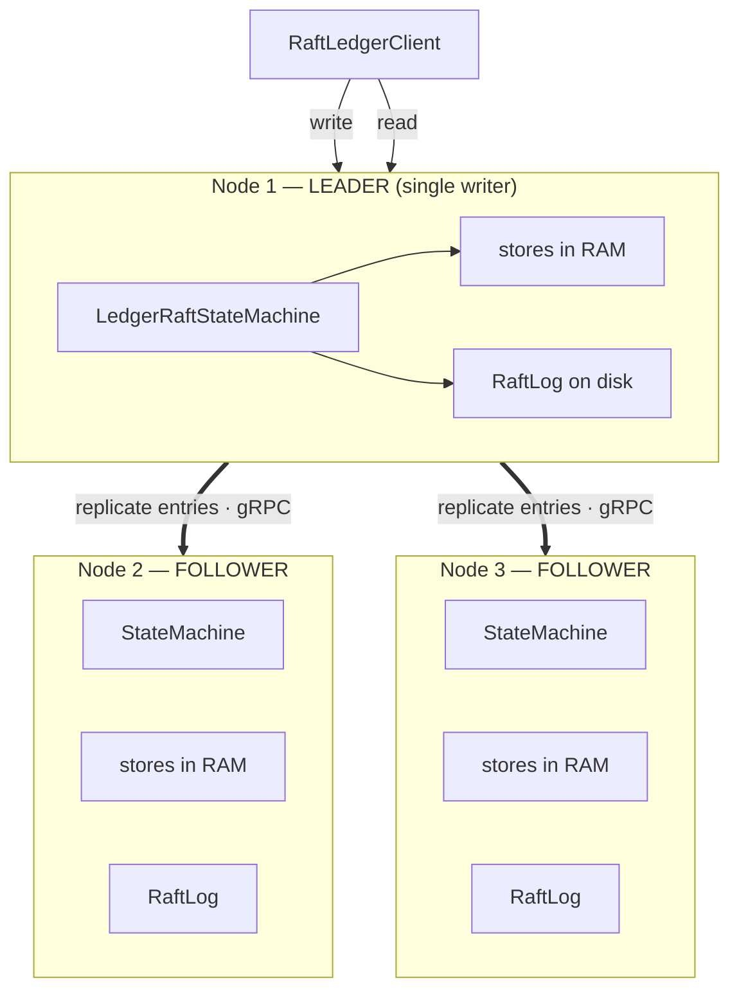
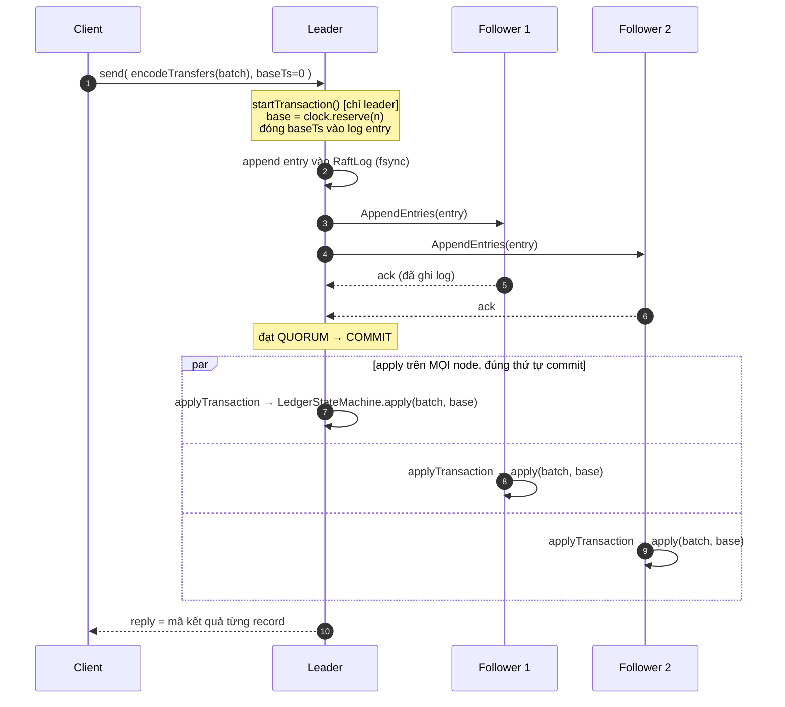
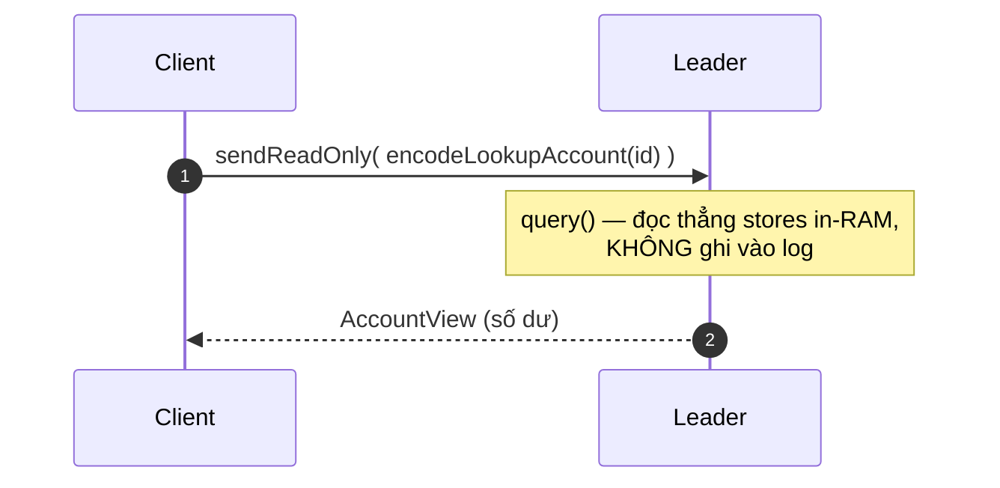
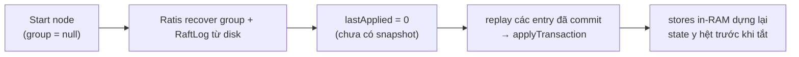
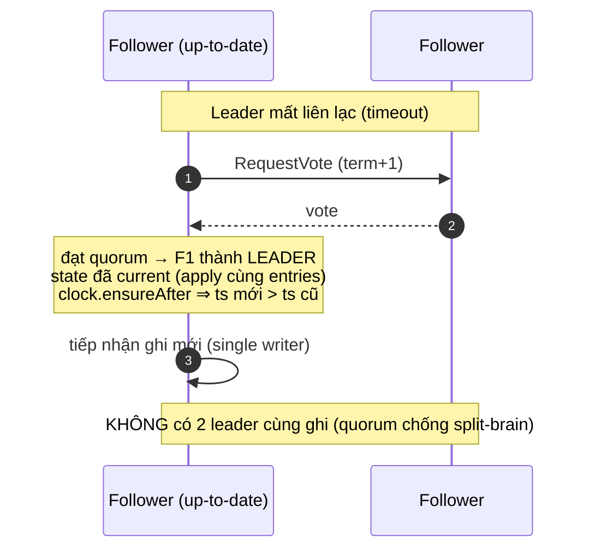
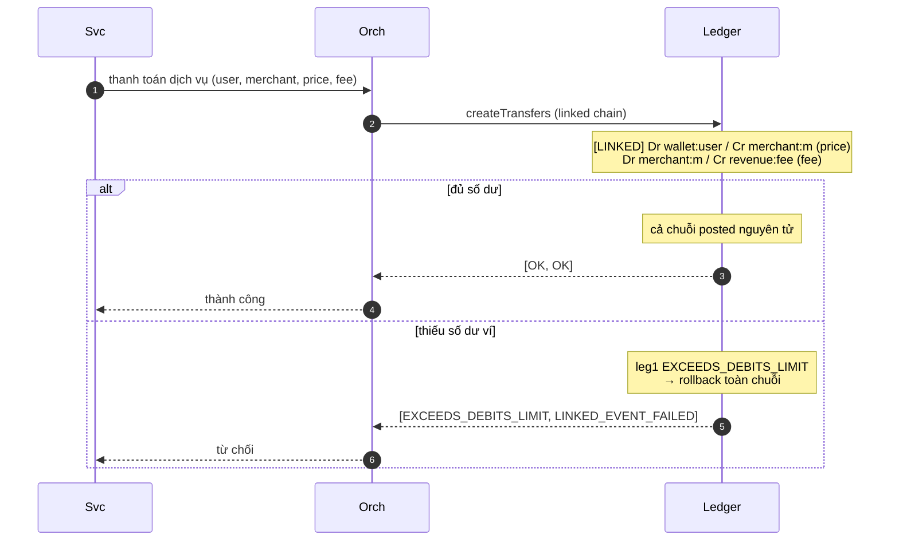
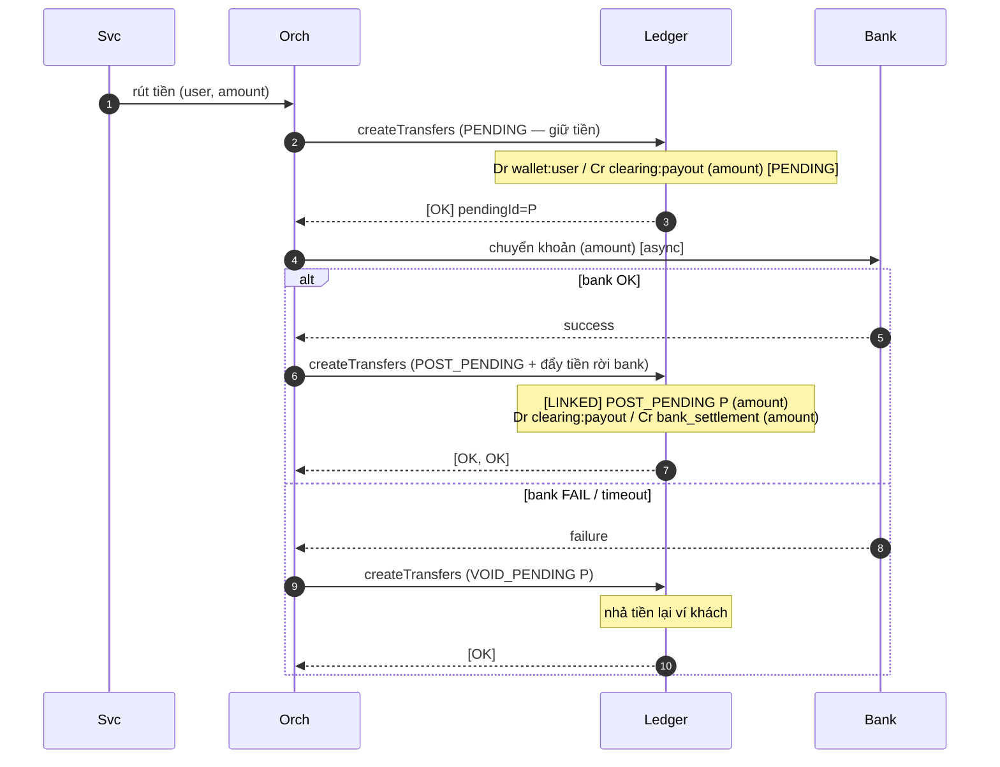

# Architecture & Design

Tài liệu này gộp toàn bộ phần nội bộ của ledger core: kiến trúc (component, thread,
vòng đời request, recovery), lý do thiết kế (quyết định + đánh đổi), cơ chế HA
Raft đã implement, và cách map một nền tảng thanh toán vào ledger. Phần "cái gì &
dùng thế nào" (mô hình nghiệp vụ, HTTP API, quick start) nằm ở
[README.md](README.md).

Mục lục:

1. [Tổng quan](#1-tổng-quan)
2. [Bản đồ component](#2-bản-đồ-component)
3. [Mô hình thread](#3-mô-hình-thread)
4. [Vòng đời request (write path)](#4-vòng-đời-request-write-path)
5. [State machine](#5-state-machine)
6. [Bền vững & phục hồi](#6-bền-vững--phục-hồi)
7. [LSM làm checkpoint store](#7-lsm-làm-checkpoint-store)
8. [Quyết định thiết kế & lý do](#8-quyết-định-thiết-kế--lý-do)
9. [Tại sao không shard](#9-tại-sao-không-shard)
10. [High availability — Raft active-passive (đã implement)](#10-high-availability--raft-active-passive-đã-implement)
11. [Tích hợp nền tảng (platform integration)](#11-tích-hợp-nền-tảng-platform-integration)
12. [Ngoài phạm vi & backlog gia cố](#12-ngoài-phạm-vi--backlog-gia-cố)

---

## 1. Tổng quan

Đây là một ledger **single-writer, in-memory, journaled**. Mọi việc đổi state được
dồn về một thread qua một ring buffer lock-free, áp vào các store in-RAM bởi một
state machine tất định, và làm bền bằng cách journal **lệnh đầu vào** vào một
write-ahead log. Phần state vượt quá một lượt replay journal được checkpoint
xuống đĩa qua một LSM snapshot store.

Thiết kế tối ưu cho thuộc tính quan trọng nhất của một ledger: **một thứ tự toàn
cục, tất định trên mọi mutation** — điều khiến tính đúng dễ lập luận và recovery
thành một phép replay thuần.

**Năm nguyên tắc thiết kế:**

1. **Single-writer determinism.** Một thread mutate toàn bộ state, theo thứ tự
   toàn cục. Không lock, không race, tính đúng quy về "logic tuần tự có đúng không?".
2. **Double-entry theo cấu trúc.** Một transfer luôn có đúng một vế nợ và một vế
   có; engine không thể biểu diễn chuyển động lệch.
3. **Determinism làm durability rẻ.** Nếu áp một lệnh là hàm thuần của (lệnh, base
   timestamp, state hiện tại) thì log chỉ cần lưu input, và recovery là replay.
4. **Mechanical sympathy ở nơi đáng.** Store primitive-array, không object
   per-account, fsync gộp. Nhưng không giáo điều (xem §8 — ring event đổi một phần
   điều này lấy ergonomics).
5. **Scope honesty.** Các điểm rút gọn (u64 amount, single node) và các cờ/mã khai
   báo-nhưng-chưa-enforce đều được nêu rõ.

## 2. Bản đồ component

```
com.payments.ledger
├── api/            tầng HTTP (Spring WebFlux): LedgerController + request DTO + Jackson config
├── client/         wrapper client tiện dụng in-process
├── config/         EngineConfig (data dir, ring size, capacities, snapshot interval)
├── domain/         Account, Transfer, flags, result enum, AccountSnapshot, UInt128
├── engine/         lõi:
│     ├── LedgerEngine          entry point, wiring Disruptor, recovery, lịch checkpoint
│     ├── LedgerEvent           event ring-buffer (một per slot)
│     ├── LedgerEventHandler    consumer duy nhất: ingestion + journaling + checkpoint
│     ├── LedgerStateMachine    logic apply thuần, tất định
│     └── IdGenerator           nguồn timestamp đơn điệu (reserve khối)
├── storage/        store in-memory: AccountStore, TransferStore,
│                   PendingTransferIndex, AccountTransferIndex (đều single-writer-owned)
├── journal/        command WAL: Journal (writer), JournalReader (replay), RecordType
├── lsm/            LSM engine độc lập (memtable/WAL/SSTable/bloom/manifest/compaction)
├── persistence/    abstraction checkpoint: SerializationProcessor (interface),
│                   LsmSerializationProcessor (LSM-backed), LedgerCodec
├── snapshot/       hỗ trợ codec/serialize snapshot
└── raft/           HA active-passive (Apache Ratis, gRPC) — opt-in (xem §10)
```

## 3. Mô hình thread

- **API threads** (Netty event loop, Spring WebFlux) nhận HTTP, dịch DTO thành
  domain object, và *publish* một event vào ring buffer Disruptor, trả về `Mono`
  bắc cầu từ `CompletableFuture` của engine. Publish là **non-blocking**
  (`ringBuffer.tryNext()`): ring đầy fail nhanh với `CapacityExceededException` →
  HTTP 429, nên event loop không bao giờ bị park.
- **Một writer thread** (`ledger-writer`) drain ring buffer và là **mutator duy
  nhất** của mọi store. Không lock ở bất kỳ đâu trên hot path vì chỉ có một writer.
- **Read cũng được tuần tự hóa trên thread writer** (lookup account/transfer, query
  lịch sử chạy như ring event). Đánh đổi chút latency đọc lấy bảo đảm read không
  bao giờ thấy batch áp dở dang.
- **Một checkpoint thread** (`ledger-checkpoint`, daemon) định kỳ *publish* một
  checkpoint event; bản thân snapshot vẫn chạy trên thread writer để thấy state
  nhất quán.

```
HTTP request
    │
    ▼
API threads (Netty / WebFlux) ─tryNext publish─┐  (ring đầy → 429)
                                    ▼
                Disruptor ring buffer (2^20 slot, lock-free, MULTI producer)
                                    │  drain (single consumer)
                                    ▼
                       Writer thread — LedgerEventHandler
                          ├── reserve khối timestamp (ts = base + index)
                          ├── LedgerStateMachine.apply  (thuần, tất định)
                          ├── journal LỆNH ĐẦU VÀO
                          ├── fsync một lần ở endOfBatch
                          └── complete future cho caller
```

## 4. Vòng đời request (write path)

1. `LedgerController` map request DTO sang `List<Account>` / `List<Transfer>` và
   gọi `LedgerEngine.createAccounts/createTransfers`.
2. `LedgerEngine.publish` claim một ring slot, reset event, điền input, gắn một
   `CompletableFuture` mới, và publish sequence.
3. `LedgerEventHandler.onEvent` trên thread writer:
   - reserve một khối timestamp liền nhau từ `IdGenerator` (`base = reserve(n)`);
   - gọi `LedgerStateMachine.createTransfers(batch, base)` — apply thuần, không I/O;
   - append **lệnh đầu vào** (batch + base timestamp) vào buffer journal;
   - ở `endOfBatch`, gọi `journal.flush()` (một fsync cho cả batch);
   - complete future của event.
4. Future trên API thread resolve với mã kết quả từng record và HTTP response trả về.

fsync xảy ra **trước khi** future complete, nên caller không bao giờ được báo "OK"
cho một lệnh chưa bền.

## 5. State machine

`LedgerStateMachine` **không I/O và không đọc wall clock**. Timestamp mỗi record là
`baseTimestamp + indexInBatch`, với `baseTimestamp` do caller cung cấp (handler
trên live path; journal trên replay path). Cùng lệnh + cùng base → state giống hệt
byte-by-byte. Đây là thuộc tính khiến recovery thành replay thuần (§6) và khiến
rollback linked-chain tái lập được.

Nó sở hữu bốn cấu trúc in-memory:

| Store | Vai trò |
|---|---|
| `AccountStore` | account dạng mảng primitive song song, map `id → slot`; counter số dư |
| `TransferStore` | transfer append-only, map `id → slot`; hỗ trợ `truncateTo` để rollback |
| `PendingTransferIndex` | status (OPEN/POSTED/VOIDED) + hạn của transfer two-phase |
| `AccountTransferIndex` | secondary index `accountId → transfer id` cho query lịch sử |

## 6. Bền vững & phục hồi

Hai cơ chế kết hợp: một **command journal** nhanh-để-append (đuôi gần đây) và
**snapshot** định kỳ (phần lớn state).

### Command journal (WAL)

Mỗi record là một lệnh đầu vào nguyên vẹn — một batch account hoặc transfer — cộng
khối timestamp reserve cho nó (không phải số dư kết quả). Record mang CRC32C;
`JournalReader` verify từng record và dừng ở record torn/truncated đầu tiên, coi
như đuôi mất điện. Lý do command-sourcing thay vì state-sourcing: xem §8.2.

### Checkpoint (snapshot)

Theo lịch (và khi shutdown êm), thread writer chụp checkpoint:

1. `journal.flush()` để offset ghi nhận đúng các lệnh đã bền;
2. lấy `offset = journal.position()`;
3. `serde.storeSnapshot(offset, offset, source)` — stream mọi account
   (`AccountSnapshot`, kèm số dư) và transfer vào LSM snapshot store;
4. append một marker `CHECKPOINT` vào journal.

Snapshot được gắn nhãn journal offset để replay từ đó.

### Recovery (khi khởi động)

```
load snapshot LSM mới nhất ─────────────▶ stores (account kèm số dư, transfer)
        │                                       │
        │ trả journalOffset                     ▼
        │                              dựng lại index dẫn xuất
        │                              (pending status, account→transfers)
        ▼                                       │
replay lệnh journal từ journalOffset ───────────┘  (áp lại qua state machine tất định)
        │
        ▼
đẩy IdGenerator vượt qua timestamp lớn nhất đã khôi phục
```

Không có snapshot thì `journalOffset = 0` và recovery thoái về replay toàn bộ.
Pending status và account-transfer index **không** được snapshot — cả hai dẫn xuất
hoàn toàn từ tập transfer và được dựng lại bằng hai lượt sau khi snapshot load.

## 7. LSM làm checkpoint store

Package `lsm/` là một log-structured merge store `UInt128 → byte[]` tự chứa
(memtable + WAL riêng + SSTable bất biến + bloom filter + size-tiered compaction +
manifest crash-atomic). Nó được nối vào hệ thống làm **snapshot backend**, không
phải hot read path. `LsmSerializationProcessor` giữ account và transfer ở hai LSM
tree riêng (id chia sẻ không gian 128-bit `UInt128`) cộng một file `meta` nhỏ có
CRC ghi snapshot id và journal offset. Mỗi checkpoint `put` lại state hiện tại;
compaction của LSM thu hồi các phiên bản cũ.

```
put/delete
    │  append (fsync) ──────────────▶ lsm.wal   (replay khi recovery)
    ▼
Memtable (red-black tree, sorted)
    │  flush khi vượt memtableFlushBytes
    ▼
SSTable  sst-<seq>.sst  (bất biến, sorted: DATA | INDEX | BLOOM | FOOTER)
    │  quá nhiều table → size-tiered compaction (k-way merge, mới thắng,
    │  tombstone bị bỏ)
    ▼
MANIFEST  (atomic rename; nguồn sự thật về table nào đang sống)
```

- **Read** check memtable, rồi từng SSTable mới→cũ, short-circuit ở hit đầu tiên.
  Bloom filter per-table bỏ qua table không thể chứa key; index in-memory đầy đủ
  biến một hit thành một seek.
- **Durability**: mọi write được WAL-append trước khi ack. Flush ghi SSTable,
  commit manifest, *rồi* xoay WAL — nên crash ở bất kỳ điểm nào cũng recover về
  trạng thái nhất quán (SSTable mồ côi không được manifest đặt tên thì bị bỏ qua).
- **Delete** là tombstone; chúng che table cũ khi read và chỉ bị bỏ vật lý trong
  full compaction, khi không còn table cũ nào sống để làm sống lại key.

Phủ bởi `LsmTest` (flush, recovery, tombstone shadowing, compaction, differential
test 5k-op ngẫu nhiên vs reference map, và từ chối CRC corruption) và
`BloomFilterTest`. Chạy: `mvn test -Dtest=LsmTest,BloomFilterTest`.

## 8. Quyết định thiết kế & lý do

### 8.1 Single-writer qua LMAX Disruptor

Một ring buffer lock-free feed một writer thread. Disruptor cho handoff
multi-producer/single-consumer với sequence barrier đảm bảo happens-before, và
`endOfBatch` cho phép amortize fsync trên cả batch drain. Read cũng tuần tự hóa
trên writer nên không bao giờ thấy batch áp dở.

**Đánh đổi:** throughput bị chặn bởi tốc độ apply của một core và độ trễ fsync,
không phải bởi song song. Với ledger điều này chấp nhận được — các ledger chuyên
dụng chọn giống vậy — và đó là lý do *không thể* đơn giản shard (§9).

### 8.2 Command-sourcing, không state-sourcing

Journal ghi **lệnh đầu vào** (một batch transfer + base timestamp reserve), một
lần, ở `endOfBatch` — không phải số dư đã đổi. Recovery áp lại lệnh qua cùng state
machine tất định.

**Tại sao quan trọng (bug nó sửa):** thiết kế gốc journal *state* per-record giữa
chừng khi đang áp một chuỗi. Nếu một linked chain fail và rollback trong RAM, các
record journal đã ghi vẫn sống, nên restart sẽ replay những hiệu ứng mà hệ thống
live đã hoàn tác — state và journal phân kỳ. Với command-sourcing, replay lệnh
chạy lại cả validate *và* rollback giống hệt, nên một chuỗi đã rollback không bao
giờ bị nửa-bền.

**Yêu cầu determinism — timestamp.** State machine gán `ts = baseTimestamp +
indexInBatch`. Base reserve một lần mỗi lệnh từ `IdGenerator.reserve(n)` (clock
đơn điệu phát khối liền nhau) và journal trong header record. Khi replay base lấy
từ journal, không đọc wall clock, timestamp tái lập chính xác. Kiểm tra hết hạn
dùng timestamp của chính thao tác làm "now", cũng tất định. Sau recovery
`IdGenerator.ensureAfter(maxRecoveredTs)` đảm bảo write mới có timestamp lớn hơn hẳn.

### 8.3 State machine thuần, không I/O

`LedgerStateMachine` nhận `(batch, baseTimestamp)` và mutate store; nó không bao
giờ chạm journal, đĩa, hay clock. Journaling và durability sống ở tầng *ingestion*
(`LedgerEventHandler`) và orchestration recovery (`LedgerEngine`). Tách biệt này là
thứ làm cùng một code path an toàn chạy trên cả live path (có journaling) lẫn
replay path (không journaling).

### 8.4 Linked-chain atomicity & rollback

Một chuỗi là một run tối đa của transfer, mỗi cái trừ cái cuối mang cờ `LINKED`.
Chuỗi áp all-or-nothing. Rollback chính xác: một `ChainUndo` ghi lại, mỗi chuỗi,

- một snapshot per-slot của bốn counter số dư trước mutation đầu tiên,
- mark kích thước transfer-store (`truncateTo` bỏ vật lý các transfer đã chèn, giải
  phóng id để retry),
- thay đổi pending-index (thêm vs đổi-status, kèm status/hạn cũ),
- các entry account-index đã thêm (gỡ LIFO).

Khi fail cả bốn được đảo; khi thành công state giữ nguyên và lệnh được journal. Vì
rollback khôi phục store về hình dạng trước-chuỗi, state sau recovery giống hệt dù
một chuỗi có fail hay không.

### 8.5 Store primitive in-memory; u128 id, u64 amount

Account/transfer không được vật chất hóa thành object per-record: trường scalar
sống trong mảng primitive song song theo slot, với map `fastutil`
`Object2IntOpenHashMap<UInt128>` từ `id → slot` (counter số dư nóng nằm trong
`long[]`). Id là 128-bit (`UInt128`, một record hai-`long` bất biến); amount giữ
`long` (u64).

**Vì sao u128 id:** caller dùng định danh sinh bên ngoài (UUID/ULID) trực tiếp —
xác suất trùng không đáng kể và không cần khóa tuần tự tập trung giữa các hệ thống
thượng nguồn.

**Đánh đổi — amount giữ u64:** max 9.2e18 (dư cho bất kỳ loại tiền nào theo minor
unit) và giảm một nửa bộ nhớ/CPU mỗi trường amount. u128 *amount* bị **hoãn có chủ
đích**: nó chạm mọi trường amount và codec journal/snapshot mà không lợi gì trong
một ledger đơn-tệ, minor-unit. Chỉ xét lại nếu transfer đa-tệ atomic số rất lớn
thành yêu cầu thật.

### 8.6 Snapshot sau một interface `SerializationProcessor`

Interface serialize cắm-được: `storeSnapshot(snapshotId, journalOffset, source)`
và `loadLatestSnapshot(sink) → journalOffset`. Tách "state lưu thế nào" khỏi engine
cho phép test dùng impl in-memory/no-op và format on-disk tiến hóa độc lập. Impl
ship sẵn (`LsmSerializationProcessor`) lưu vào LSM (§7). Một snapshot ghép full
state (kèm số dư) với journal offset để replay; pending status và account index
*không* lưu vì dẫn xuất được từ tập transfer và dựng lại khi load.

### 8.7 Lịch sử account qua secondary index

`get_account_transfers` nếu không có sẽ cần quét toàn bộ transfer store.
`AccountTransferIndex` giữ `accountId → transfer id` theo thứ tự timestamp, cập
nhật mỗi insert (dưới cả account nợ và có), rollback cùng chuỗi, và dựng lại từ tập
transfer khi recovery (sort theo timestamp nên lịch sử theo thứ tự thời gian bất kể
thứ tự load).

### 8.8 Thiết kế Disruptor event và các sharp edge

`LedgerEvent` là event **mang reference**: nó giữ con trỏ tới
`List<Account>`/`List<Transfer>` do caller cấp phát, danh sách kết quả, và một
`CompletableFuture`. Ergonomic nhưng lệch với lý tưởng "flyweight" của Disruptor (một
flyweight event sẽ toàn primitive + enum mã kết quả + pooled result event, chia
payload lớn thành nhiều message kích thước cố định). Các hệ quả cần nhớ:

- **Backpressure — *đã giải quyết*.** API chạy trên Netty event loop (WebFlux), nơi
  block là chí mạng. `publish()` dùng `ringBuffer.tryNext()` (non-blocking): ring
  đầy ném `CapacityExceededException` → controller map thành **HTTP 429** thay vì
  park thread event-loop. Hàm `ringBuffer.next()` blocking đã bị bỏ.
- **Payload không chặn per-slot.** Một lời gọi `createTransfers` có thể mang danh
  sách lớn tùy ý, nên một ring slot có thể giữ một batch lớn tùy ý. Ring được sizing
  cho nhiều event nhỏ; vài batch khổng lồ làm dùng bộ nhớ khó đoán. **Giảm thiểu:
  chặn batch size** (vd vài nghìn transfer/batch); tách request lớn ở tầng API.
- **Slot retention.** Một slot đã xử lý giữ reference cho tới khi producer *reclaim*
  slot đó (có thể tới một vòng ring sau) và gọi `reset()`. Với payload lớn điều này
  ghim `ringSize × payload` bộ nhớ. **Giảm thiểu: clear reference của event trong
  consumer ngay sau khi complete future.**
- **Trả event tái chế cho caller là mong manh.** Handler complete future với *object
  event*, và engine đọc `e.transferResults` trong một `thenApply`. An toàn **hiện
  nay chỉ vì** mapping đó chạy đồng bộ bên trong `complete()` trên thread writer,
  trích giá trị trước khi slot bị tái dùng. Một continuation async, hoặc complete từ
  thread khác, sẽ race việc tái dùng slot và đọc dữ liệu của request khác. **Giảm
  thiểu: complete future bằng giá trị kết quả đã trích, không bao giờ bằng event.**

Không cái nào là bug *live* hiện tại, nhưng đây là các sharp edge cần sửa trước khi
đẩy batch lớn hoặc concurrency cao hơn. Chúng không ảnh hưởng tính đúng của logic
apply single-writer.

### Ảnh hưởng thiết kế

Ý tưởng đã chứng minh, mượn từ các ledger chuyên dụng và engine khớp lệnh/sàn
throughput cao:

| Ý tưởng | Áp dụng |
|---|---|
| Single-writer deterministic state machine | có |
| Double-entry, two-phase pending, linked chain, flags, result code | có |
| Command journaling + replay qua engine | có |
| Snapshot gắn sequence/offset; replay chỉ phần đuôi | có |
| Serialization cắm-được (`SerializationProcessor`) | có |
| fsync gộp ở end-of-batch | có |
| Ingestion non-blocking + backpressure fail-fast | có (`tryNext` → 429) |
| Tầng HTTP reactive (event loop, ít thread) | có (WebFlux / Netty) |
| Flyweight ring event + chia payload lớn | **chưa** (xem §8.8) |
| Object pooling để bỏ allocation hot-path | chưa (fsync-bound, ROI thấp) |
| Khớp lệnh / order book / margin | N/A (đây là ledger) |
| Shard theo symbol | N/A (xem §9) |

## 9. Tại sao không shard

Engine sàn throughput cao shard theo symbol vì một trade chạm đúng một order book
và account của hai user (risk shard theo user). Một transfer ledger chạm **hai
account tùy ý**, và linked transfer có thể trải account tùy ý, nên không có shard
key sạch nào giữ được atomicity liên-account cục bộ. Đây cũng là lý do các ledger
chuyên dụng chạy một writer toàn cục. Vì vậy scale ngang nghĩa là replication cho
HA (vd Apache Ratis), không phải phân vùng writer.

## 10. High availability — Raft active-passive (đã implement)

Package `com.payments.ledger.raft` (Apache Ratis 3.1.0, gRPC) implement replication
**active-passive**: một leader là writer duy nhất, follower replay cùng log để giữ
state giống hệt; leader chết thì bầu follower lên thay.

> Ánh xạ với mô hình single-node: **RaftLog thay Journal+Disruptor** trên đường
> ghi; `applyTransaction` chính là **điểm mutate duy nhất** (single-writer, nay
> replicated). Tái dùng nguyên `LedgerStateMachine` + stores + enum kết quả.

### Topology



### Đường GHI — `client.io().send(...)`



Điểm cốt lõi:
- **base timestamp** do leader cấp ở `startTransaction` rồi **nằm trong log** ⇒ mọi
  node tính `ts = base + index` giống hệt (không đọc wall clock).
- Command chỉ trả về client **sau khi commit** (quorum đã ghi log) — tương tự
  "fsync trước khi báo OK" của bản single-node, nay là "replicated trước khi báo OK".
- `applyTransaction` còn gọi `clock.ensureAfter(base+n-1)` trên **mọi** node.

### Đường ĐỌC — `client.io().sendReadOnly(...)`



### Recovery khi restart — replay RaftLog



Hiện chưa tích hợp snapshot LSM ⇒ recovery = **replay toàn bộ log đã commit** (đã
test: tắt node → bật lại → số dư khôi phục đúng).

### Failover khi leader chết (đã test 3-node)



### Ánh xạ code ↔ khái niệm Raft

| Khái niệm Raft | Trong code |
|---|---|
| Replicated log entry | command `[op][baseTs][payload]` (`raft/LedgerCommandCodec`) |
| State machine apply | `applyTransaction` → `LedgerStateMachine.apply` (`raft/LedgerRaftStateMachine`) |
| Gán dữ liệu trước khi replicate (leader) | `startTransaction` (reserve + stamp base ts) |
| Read-only query | `query()` đọc stores in-RAM |
| Server/transport | `RaftServer` gRPC (`raft/RaftLedgerServer`) |
| Client | `RaftClient` (`raft/RaftLedgerClient`) |
| Bootstrap vs recover | `setGroup(group)` lần đầu; `group=null` khi restart |

### Trạng thái HA

- ✅ Test 1-node: write replicate→apply, read, idempotency, restart-recovery bằng
  replay log (`raft/RaftReplicationTest`).
- ✅ Test **failover 3-node**: ghi committed → giết leader → bầu leader mới → state
  committed sống sót, retry cùng id ra `EXISTS` (không double-apply / không transfer
  ma), tiếp tục ghi được (`raft/RaftFailoverTest`).
- ⏳ Chưa tích hợp **snapshot + purge RaftLog** (log grow vô hạn — giống backlog
  journal-truncation của bản single-node).
- ⏳ Chưa wire vào Spring/HTTP (module opt-in).

## 11. Tích hợp nền tảng (platform integration)

Phần này xác định **ranh giới của repo** và **verify** rằng ledger core biểu diễn
được mọi business flow của nền tảng thanh toán bằng các primitive sẵn có — hoặc chỉ
rõ gap.

> Phạm vi: repo này **chỉ là LEDGER CORE** — nguồn sự thật về số dư, double-entry,
> deterministic. Các module **Payment Orchestration**, **Bank/Core-Banking
> Connector**, **Identity/KYC**, **Merchant onboarding**, **Integration Hub** nằm ở
> repo khác. Ở đây chúng chỉ xuất hiện ở mức *ranh giới* (ai gọi vào, ledger trả gì).

### 11.1 Bức tranh tổng thể (mức ranh giới)

```
   Identity/KYC ──(KYC tier ⇒ hạn mức)──┐
                                        ▼
 Platform services ─▶ Payment Orchestration ─▶  ┌────────────────────┐
                          │  (saga, outbox)      │  LEDGER CORE       │
                          │                      │  (repo này)        │
 Bank/Core Banking ◀──────┤  lệnh đi tiền        │  - tài khoản+số dư │
 Billers / Insurance ◀────┤  (async, dễ lỗi)     │  - double-entry    │
                          │                      │  - pending 2 pha   │
                          └──ghi kết quả bằng───▶ │  - linked chain    │
                             bút toán             │  = NGUỒN SỰ THẬT   │
                                                  └─────────┬──────────┘
 Reconciliation ◀── đối soát ledger ⇄ bank/provider ────────┘
```

**Hợp đồng của ledger core với bên ngoài:**
- Đầu vào: lệnh tạo `Account` / `Transfer` theo lô, idempotent theo `id`.
- Đầu ra: mã kết quả cho từng phần tử (`OK` / `EXISTS` / mã lỗi).
- Ledger **không** gọi ra ngoài, **không** đọc đồng hồ thực, **không** biết về
  bank/provider. Mọi việc async do Orchestration lo; ledger chỉ *ghi sự thật*.

### 11.2 Nguyên thủy đã verify trong code

| Primitive | Mô tả | Vị trí | Trạng thái |
|---|---|---|---|
| **Standard transfer** | 1 nợ + 1 có, posted ngay | `LedgerStateMachine.tryApplyTransfer` | ✅ |
| **Two-phase pending** | PENDING giữ → POST chốt (cho phép chốt một phần) / VOID nhả | `applyPostOrVoid` | ✅ |
| **Linked chain** | chuỗi all-or-nothing, rollback đầy đủ | `processChain` + `ChainUndo` | ✅ |
| **Balance limit** | chặn âm/quá hạn mức (`EXCEEDS_*_LIMIT`) | `AccountStore.wouldExceed*Limit` | ✅ |
| **Overflow guard** | từ chối transfer làm tràn u64 | `addOverflows` | ✅ |
| **Idempotency** | `id` trùng + cùng field → `EXISTS` | `tryApplyTransfer` (so sánh `.equals`) | ✅ |
| **Pending expiry** | auto-void pending hết hạn, replay được (lệnh `EXPIRE`) | `expirePending` | ✅ |
| **Account history** | secondary index `account → transfers`, newest-first | `AccountTransferIndex` | ✅ |
| **Trial balance** | tổng counter theo ledger (kiểm money conservation) | `trialBalance` | ✅ |

### 11.3 Chart of accounts đề xuất

Ledger không có "loại tài khoản" first-class — integrator tự mã hóa qua `code` +
chọn cờ giới hạn số dư đúng bản chất.

| Tài khoản | Bản chất | Cờ cần đặt | Đọc số dư |
|---|---|---|---|
| `wallet:{userId}` | Liability (credit-normal) | `DEBITS_MUST_NOT_EXCEED_CREDITS` → **chống âm ví** | `creditBalance()` |
| `merchant:{id}` | Liability | `DEBITS_MUST_NOT_EXCEED_CREDITS` | `creditBalance()` |
| `bank_settlement` (tài khoản đảm bảo) | Asset (debit-normal) | `CREDITS_MUST_NOT_EXCEED_DEBITS` | `debitBalance()` |
| `revenue:fee` | Income | `DEBITS_MUST_NOT_EXCEED_CREDITS` | `creditBalance()` |
| `clearing:payout` / `clearing:deposit` | Trung gian | *(không cờ — swing 2 chiều)* | tùy |
| `provider_clearing:{biller/insurer}` | Trung gian | *(không cờ)* | tùy |
| `suspense` | Trung gian (tiền lệch) | *(không cờ)* | tùy |

**Invariant money conservation** (kiểm qua `GET /v1/trial-balance`):
`Σ wallet + Σ merchant + Σ revenue (liability/income) ≈ Σ bank_settlement (asset) ± Σ clearing`.

### 11.4 Business flow → bút toán

Ký hiệu: `Dr X / Cr Y (amount) [flag]`. Mỗi dòng trong một lô; nhiều dòng `[LINKED]`
liên tiếp = một chuỗi nguyên tử.

**Nạp tiền (deposit qua Virtual Account / VietQR)** — tiền *đã* về tài khoản đảm
bảo rồi mới ghi → không cần pending. Primitive: standard transfer.
```
Dr bank_settlement / Cr wallet:user   (số nạp)
```

**Thanh toán dịch vụ nội bộ bằng ví, có phí** — primitive: linked chain (atomic).
Âm ví bị chặn bởi cờ trên `wallet`; nếu leg phí fail, cả chuỗi rollback.
```
Dr wallet:user   / Cr merchant:m     (giá)  [LINKED]
Dr merchant:m    / Cr revenue:fee    (phí)
```

**Giữ tiền / pre-authorization** — primitive: two-phase (chốt một phần được hỗ trợ).
```
PENDING:  Dr wallet:user / Cr merchant_clearing  (số giữ) [PENDING, timeoutSeconds=...]
Capture:  POST_PENDING  pendingId=...  (≤ số giữ)   → phần dư tự nhả
Release:  VOID_PENDING  pendingId=...
```

**Rút tiền / payout ra bank thật (async)** — primitive: two-phase + standard. Pending
phát huy ở đây: khách không bị "bốc hơi" tiền khi bank đang xử lý; thất bại thì hoàn
nguyên tự động.
```
① Reserve (lúc nhận lệnh):
   Dr wallet:user / Cr clearing:payout   (số rút) [PENDING]
② Connector gọi bank (repo khác) ───────────────────────────
③a Bank OK:
   POST_PENDING pendingId=①            → chốt wallet→clearing:payout
   Dr clearing:payout / Cr bank_settlement (số rút)  ← tiền thật rời tài khoản đảm bảo
③b Bank FAIL/timeout:
   VOID_PENDING pendingId=①            → nhả tiền lại ví khách
```

**Hoàn tiền (refund giao dịch đã posted)** — ledger append-only ⇒ không sửa/void
transfer posted cũ; refund là bút toán đảo MỚI. (VOID chỉ cho *pending*.)
```
Dr merchant:m / Cr wallet:user   (số hoàn)
```

**Chuyển tiền P2P (ví → ví)** — standard; âm ví A bị chặn bởi cờ giới hạn.
```
Dr wallet:A / Cr wallet:B   (số chuyển)
```

**Thanh toán hóa đơn (biller) / mua bảo hiểm (provider async)** — giống payout nhưng
đích là clearing của provider. Primitive: two-phase.
```
PENDING: Dr wallet:user / Cr provider_clearing:{x}  [PENDING]
OK → POST_PENDING ;  FAIL → VOID_PENDING
```

**Settlement merchant (gom doanh thu → payout T+n)** — số dư `merchant:m` tích lũy;
đến kỳ chạy flow payout với nguồn là `merchant:m`. **Merchant nội bộ** có thể chỉ
netting nội bộ (không đi tiền ra bank) → tiết kiệm phí.

**Đa tiền tệ / FX** — ⚠️ qua pattern. Một transfer chỉ trong cùng ledger; FX = linked
2 leg khác ledger. Mỗi leg cùng-ledger nên hợp lệ; `processChain` xử lý từng transfer
độc lập nên chuỗi spanning 2 ledger vẫn nguyên tử. Đây là *pattern* (không phải FX
atomic gốc) — chấp nhận được, nhưng Orchestration phải đảm bảo tỷ giá X/Y nhất quán.
```
Dr wallet:user(VND) / Cr fx_clearing(VND)  (X) [LINKED]   ← ledger VND
Dr fx_clearing(USD) / Cr wallet:user(USD)  (Y)            ← ledger USD
```

### 11.5 Sequence diagram (chọn lọc)

Quy ước participant: `Svc` = platform service, `Orch` = Payment Orchestration (repo
khác), `Ledger` = ledger core (repo này), `Bank` = Bank Connector, `Prov` =
Biller/Insurer Connector. Mọi lời gọi vào ledger đều là `createTransfers([...])`
idempotent theo transfer id.

**Thanh toán nội bộ + phí (linked, atomic):**



**Rút tiền / payout ra bank (async, two-phase):**



### 11.6 Walkthrough end-to-end (2 case)

Ledger dùng: **VND = 704**. Số tiền tính theo đồng (minor unit). Tài khoản dựng một
lần:

| id | Vai trò | Bản chất | `flags` |
|---|---|---|---|
| `1001` | `wallet:user` | Liability | `2` (DEBITS_MUST_NOT_EXCEED_CREDITS → chống âm ví) |
| `2001` | `merchant` | Liability | `2` |
| `9001` | `bank_settlement` (tài khoản đảm bảo) | Asset | `4` (CREDITS_MUST_NOT_EXCEED_DEBITS) |
| `9002` | `revenue:fee` | Income | `2` |
| `9003` | `collection_clearing` (thu hộ từ bank) | Clearing | `0` (swing 2 chiều) |

**Case 1 — Nạp tiền vào ví, rồi mua hàng bằng số dư ví** (tức thời, không gọi bank;
linked chain trừ ví + thu phí nguyên tử):

```
B1) Deposit 1.000.000:  Dr bank_settlement(9001) / Cr wallet(1001) — 1.000.000
    → wallet creditBalance = 1.000.000
B2) Mua hàng 300.000, phí 5.000 (linked):
    [LINKED] Dr wallet(1001) / Cr merchant(2001) — 300.000
             Dr merchant(2001) / Cr revenue(9002) — 5.000
    → wallet = 700.000; merchant = 295.000; revenue = 5.000
    Nếu ví không đủ: leg1 EXCEEDS_DEBITS_LIMIT → cả chuỗi rollback, không trừ gì.
    trial-balance: debits = credits = 1.305.000 → balanced=true
```

**Case 2 — Quét QR tại cửa hàng, trả trực tiếp từ tài khoản bank** (KHÔNG dùng số dư
ví; two-phase vì thu tiền từ bank là async). `collection_clearing(9003)` = "tiền đang
thu hộ từ bank":

```
B1) Quét QR → giữ khoản cho cửa hàng (PENDING, timeout 900s):
    Dr collection_clearing(9003) / Cr merchant(2001) — 500.000 [PENDING]
    → merchant.creditsPending = 500.000
B2a) Bank thu thành công → chốt (linked 3-leg):
    [LINKED] POST_PENDING 6101 — 500.000
             Dr bank_settlement(9001) / Cr collection_clearing(9003) — 500.000
             Dr merchant(2001) / Cr revenue(9002) — 7.500
    → bank_settlement debitBalance = 500.000 (tiền thật)
      merchant creditBalance = 492.500; clearing net = 0; ví user KHÔNG đổi
B2b) Bank lỗi/timeout → VOID_PENDING 6101 → nhả pending, không ai mất tiền.
     Nếu Orchestration "quên" cả POST lẫn VOID → sweep EXPIRE tự void sau 900s.
```

| | Case 1 (ví) | Case 2 (trực tiếp từ bank) |
|---|---|---|
| Nguồn tiền | số dư ví (`wallet`) | tài khoản ngân hàng của user |
| Có động vào ví? | có (trừ ví) | **không** |
| Tức thời / async? | tức thời (không gọi bank) | async (chờ bank thu) |
| Primitive | linked chain | two-phase (PENDING→POST/VOID) + linked |
| Rủi ro xử lý | đủ/thiếu số dư | bank thu thất bại → VOID/EXPIRE |

### 11.7 Verification & gap

| Business flow | Primitive | Hỗ trợ |
|---|---|---|
| Nạp tiền (deposit) | standard | ✅ |
| Thanh toán nội bộ + phí | linked chain | ✅ |
| Giữ tiền / pre-auth / capture một phần | two-phase | ✅ |
| Rút tiền / payout ra bank | two-phase + standard | ✅ |
| Hoàn tiền (refund) | standard (đảo) | ✅ |
| P2P ví → ví | standard | ✅ |
| Hóa đơn / bảo hiểm (provider async) | two-phase | ✅ |
| Settlement merchant / netting nội bộ | tích lũy + payout | ✅ |
| Chống âm ví / hạn mức | balance-limit flag | ✅ |
| Idempotent retry (at-least-once) | `EXISTS` theo id | ✅ |
| Pending hết hạn tự nhả | `EXPIRE` (replay được) | ✅ |
| Đa tiền tệ / FX | linked 2-leg pattern | ⚠️ qua pattern |
| Đóng ví/tài khoản bằng transfer | `CLOSING_DEBIT/CREDIT` | ❌ gap |
| "Quét" hết số dư khả dụng | `BALANCING_DEBIT/CREDIT` | ❌ gap |
| Stream giao dịch ra ngoài (CDC) | `HISTORY` | ❌ gap |

**Gap cần bổ sung ở ledger core** (sắp theo ưu tiên):

1. **`CLOSING_DEBIT/CREDIT`** — khai báo, chưa enforce. Cần để đóng ví/tài khoản khi
   user/merchant rời nền tảng. Hiện `CLOSED` chỉ đặt được lúc tạo → cần xử lý cờ này
   trong `tryApplyTransfer` để set `CLOSED` qua một transfer.
2. **Validate `PENDING_TRANSFER_HAS_DIFFERENT_*`** — chưa produce. Khi POST/VOID,
   ledger lấy thẳng account/ledger của transfer gốc thay vì đối chiếu giá trị bên
   gọi gửi lên. Nên đối chiếu để bắt lỗi Orchestration gửi sai.
3. **`HISTORY` + CDC stream** — chưa có. Reconciliation/notification/audit downstream
   cần stream sự kiện. Hiện history chỉ query được qua secondary index → cần
   outbox/CDC từ journal.
4. **HA / replication** — bản single-node. Module Raft active-passive (§10) đã
   implement & test failover; còn cần snapshot+purge log và wire vào HTTP.
5. **`BALANCING_DEBIT/CREDIT`** — khai báo, chưa enforce. Cho "chuyển tối đa theo số
   dư khả dụng". Nice-to-have.
6. **FX atomic gốc** — hiện chỉ qua linked 2-leg. Cân nhắc khi đa tiền tệ thành yêu
   cầu thật (liên quan hoãn u128 *amount*, §8.5).

Không thuộc repo này (ở repo khác): orchestration saga, outbox gọi bank,
KYC-tier→hạn mức (ledger chỉ enforce balance-limit; hạn mức theo KYC do Orchestration
kiểm trước khi gọi vào), connector core banking, đối soát.

**Kết luận:** ledger core đáp ứng toàn bộ flow tiền cốt lõi (nạp/chi/giữ/rút/hoàn/
P2P/settlement) bằng 3 primitive — standard transfer, two-phase pending, linked
chain — cộng balance-limit chống âm và idempotency để retry an toàn. Các điểm thiếu
(`CLOSING`, validate pending-different, CDC, BALANCING) đều là **bổ sung gia cố**,
không phải thay đổi mô hình. Double-entry + determinism là nền vững để mở rộng.

## 12. Ngoài phạm vi & backlog gia cố

### Cố ý ngoài phạm vi

- **u128 amount** — hoãn (§8.5). (Id *là* u128 / `UInt128`; chỉ amount giữ u64.)
- **VSR consensus tự xây / state sync / cross-peer repair** — dùng Raft ngoài
  (Apache Ratis, §10) cho HA, hoặc chấp nhận single-node với snapshot DR.
- **VOPR-style deterministic fuzzing** — determinism đã sẵn để *cho phép* việc này
  về sau; hiện chỉ có unit/integration test.
- **Multiversion binaries / rolling upgrade.**
- **Cờ transfer khai báo-nhưng-chưa-enforce** — `BALANCING_DEBIT/CREDIT`,
  `CLOSING_DEBIT/CREDIT`, `HISTORY` (CDC) định nghĩa trong `TransferFlags`/
  `AccountFlags` cho tương thích giao thức nhưng state machine chưa hành động. Mã
  `PENDING_TRANSFER_HAS_DIFFERENT_*` cũng định nghĩa nhưng chưa trả. (`OVERFLOWS_*`
  *đã* enforce.)

### Đã làm — gia cố chuẩn kế toán

- **u64 overflow guard** — transfer làm tràn counter bị từ chối `OVERFLOWS_*`
  (identity debit==credit toàn cục giữ mod 2^64 cả khi wrap, nhưng số dư per-account
  sẽ hỏng).
- **Helper số dư per-side** — `AccountSnapshot.debitBalance()` / `creditBalance()`
  bỏ mơ hồ một-quy-ước.
- **Trial balance** — `GET /v1/trial-balance` phơi invariant bảo toàn per-ledger để
  đối soát.
- **Sweep pending-expiry tất định** — lệnh `EXPIRE` journal hóa, replay được.

### Backlog vận hành

1. Halt-on-journal-failure thay vì chỉ surface lỗi (divergence giữa state in-memory
   và journal là không an toàn).
2. Cắt journal sau một checkpoint thành công.
3. Checkpoint ngoài thread / copy-on-write để snapshot không làm dừng ghi.
4. Chặn batch size + clear-on-consume + complete-with-value (§8.8).
5. CDC stream, metrics (Micrometer), test recovery fault-injection cho WAL.
6. (HA) snapshot + purge RaftLog; wire module Raft vào Spring/HTTP.
