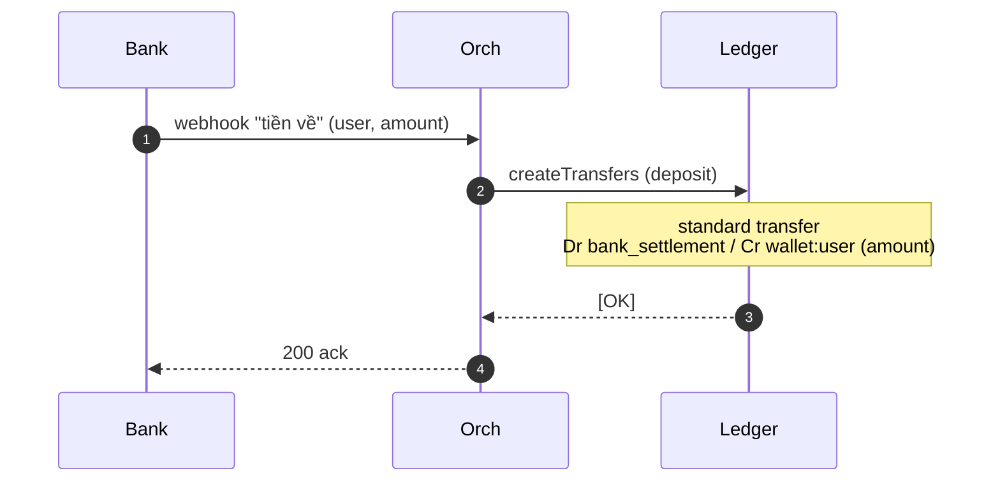
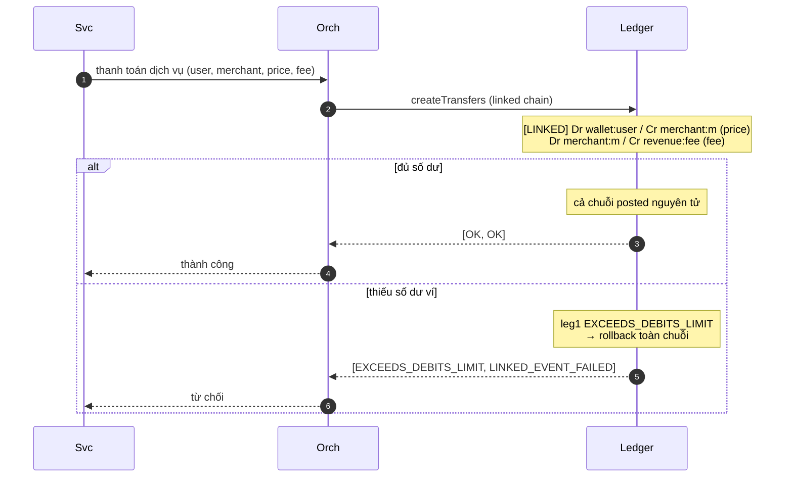
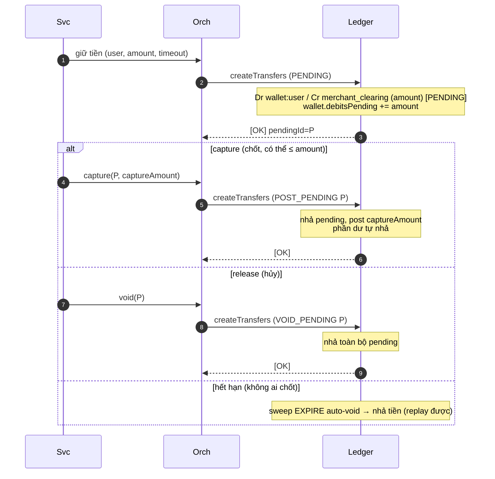
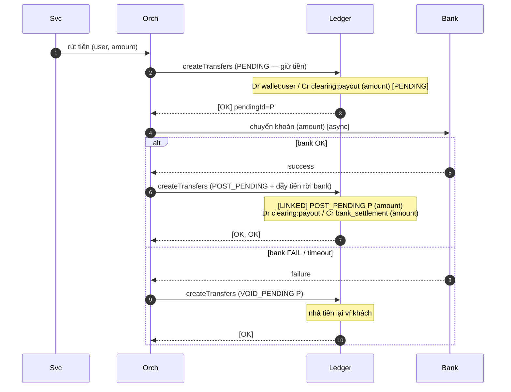
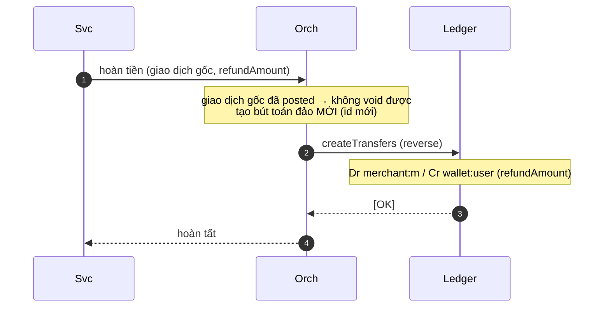
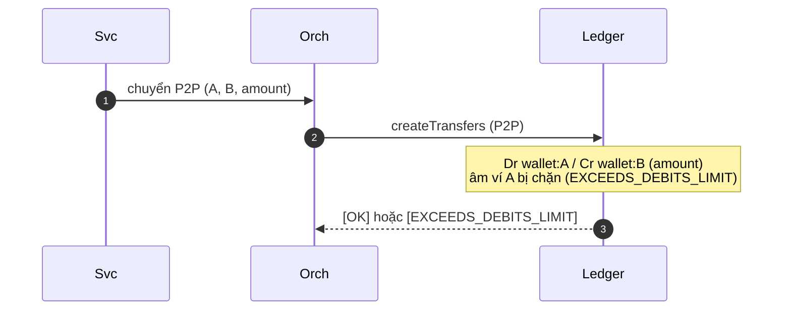
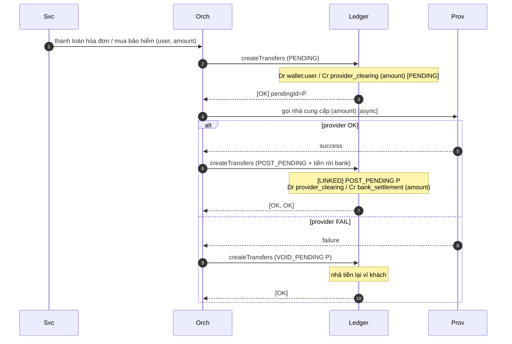
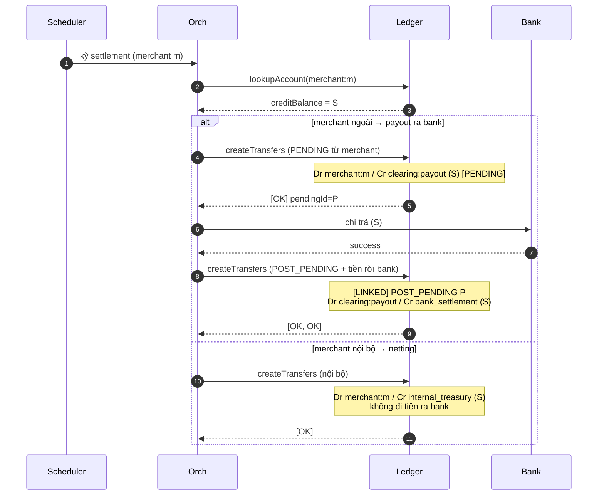

# Sequence diagrams từng flow (Mermaid)

Các diagram dưới đây tập trung vào **tương tác với ledger core** (chi tiết bút toán:
xem [Business flows → postings](business-flows.md)). Quy ước participant:
`Svc` = platform service, `Orch` = Payment Orchestration (repo khác),
`Ledger` = ledger core (repo này), `Bank` = Bank Connector (repo khác),
`Prov` = Biller/Insurer Connector (repo khác). Mọi lời gọi vào ledger đều là
`createTransfers([...])` idempotent theo transfer id; bút toán đặt trong `Note`.

## 8.1 Nạp tiền (deposit)



## 8.2 Thanh toán nội bộ + phí (linked, atomic)



## 8.3 Giữ tiền / pre-auth → capture / release (two-phase)



## 8.4 Rút tiền / payout ra bank (async)



## 8.5 Hoàn tiền (refund — bút toán đảo, KHÔNG void)



## 8.6 Chuyển tiền P2P (ví → ví)



## 8.7 Hóa đơn / bảo hiểm (provider async)



## 8.8 Settlement merchant (T+n: payout ngoài vs netting nội bộ)



## 8.9 Đổi tiền / FX (linked 2-leg cross-ledger)

```mermaid
sequenceDiagram
    autonumber
    participant Svc
    participant Orch
    participant Ledger
    Svc->>Orch: đổi tiền (user, X VND → Y USD theo rate)
    Orch->>Ledger: createTransfers (linked 2-leg, 2 ledger)
    Note over Ledger: [LINKED] Dr wallet:user(VND) / Cr fx_clearing(VND) (X)  — ledger=VND<br/>Dr fx_clearing(USD) / Cr wallet:user(USD) (Y)  — ledger=USD
    Note over Ledger: mỗi leg cùng-ledger nên hợp lệ;<br/>chuỗi spanning 2 ledger vẫn nguyên tử
    Ledger-->>Orch: [OK, OK]
```
