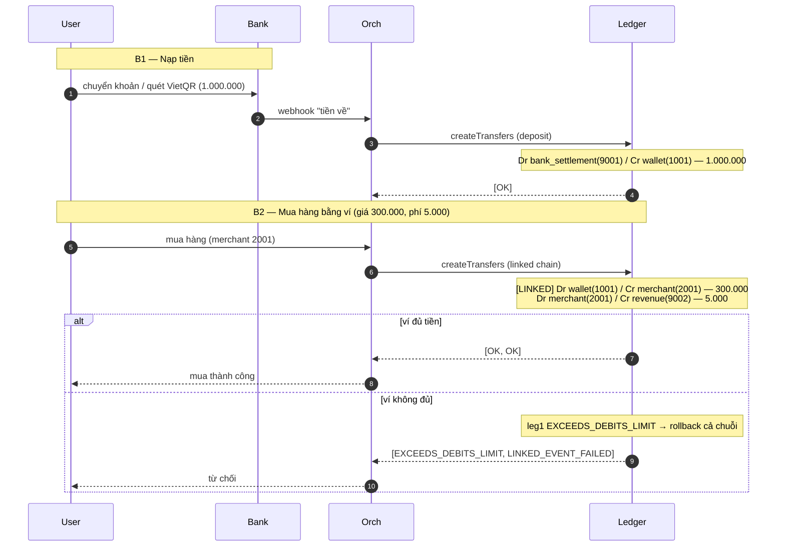
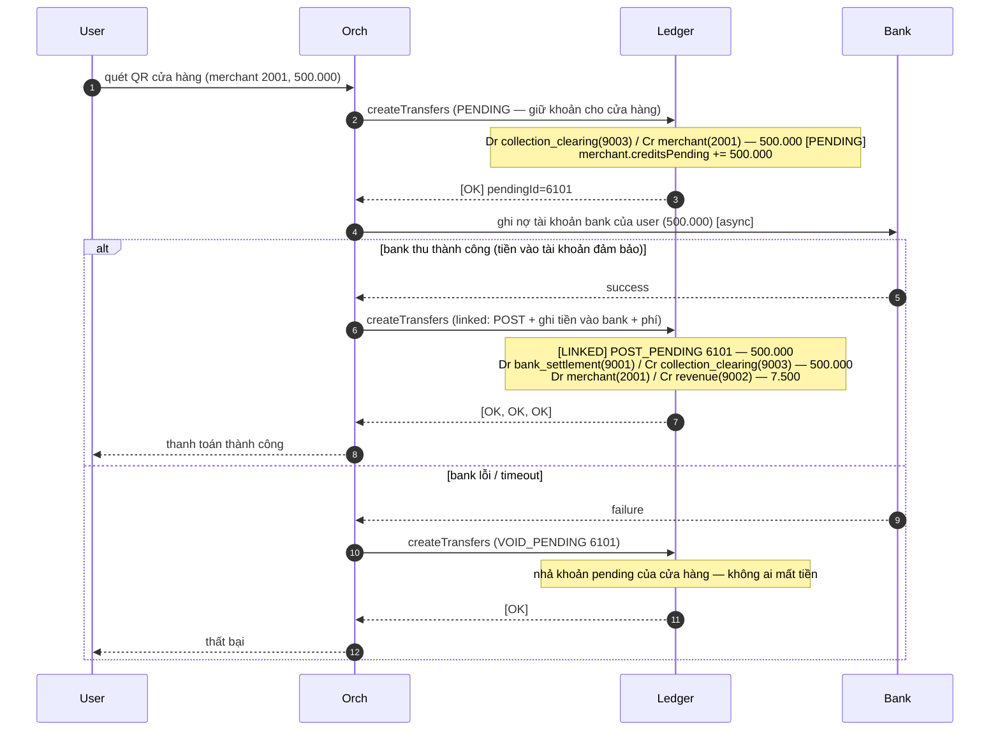

# End-to-end walkthroughs

Hai use case đi từ đầu đến cuối, từng bước, kèm lời gọi HTTP thật vào ledger và
**số dư sau mỗi bước**. Quy ước: `Orch` = Payment Orchestration, `Bank` = Bank
Connector (repo khác) — ở đây chỉ hiện để thấy *thời điểm* gọi ledger; bản thân
ledger chỉ nhận `createTransfers([...])`.

Ledger dùng trong ví dụ: **VND = 704**. Số tiền tính theo đồng (minor unit).

## 0. Tạo tài khoản (chạy một lần)

| id | Vai trò | Bản chất | `flags` |
|---|---|---|---|
| `1001` | `wallet:user` | Liability | `2` (DEBITS_MUST_NOT_EXCEED_CREDITS → chống âm ví) |
| `2001` | `merchant` (cửa hàng) | Liability | `2` |
| `9001` | `bank_settlement` (tài khoản đảm bảo) | Asset | `4` (CREDITS_MUST_NOT_EXCEED_DEBITS) |
| `9002` | `revenue:fee` | Income | `2` |
| `9003` | `collection_clearing` (thu hộ từ bank) | Clearing | `0` (swing 2 chiều) |

```bash
curl -s -X POST localhost:8081/v1/accounts -H 'Content-Type: application/json' \
  -d '{"accounts":[
    {"id":"1001","ledger":704,"code":10,"flags":2,"userData64":0,"userData32":0},
    {"id":"2001","ledger":704,"code":20,"flags":2,"userData64":0,"userData32":0},
    {"id":"9001","ledger":704,"code":30,"flags":4,"userData64":0,"userData32":0},
    {"id":"9002","ledger":704,"code":40,"flags":2,"userData64":0,"userData32":0},
    {"id":"9003","ledger":704,"code":50,"flags":0,"userData64":0,"userData32":0}
  ]}'
# → ["OK","OK","OK","OK","OK"]
```

---

## Case 1 — Nạp tiền vào ví, rồi mua hàng bằng số dư ví

> Nguồn tiền là **số dư ví**. Thanh toán mua hàng là **tức thời** (không gọi bank),
> dùng linked chain để trừ ví + thu phí nguyên tử.



### Bước 1 — Nạp 1.000.000 vào ví

Bank Connector nhận webhook tiền về → Orchestration ghi 1 bút toán thường:

```bash
curl -s -X POST localhost:8081/v1/transfers -H 'Content-Type: application/json' \
  -d '{"transfers":[
    {"id":"5001","debitAccountId":"9001","creditAccountId":"1001","amount":1000000,
     "pendingId":"0","userData64":0,"userData32":0,"timeoutSeconds":0,
     "ledger":704,"code":700,"flags":0}
  ]}'
# → ["OK"]
```

Số dư sau bước 1:

| Account | debitsPosted | creditsPosted | Số dư |
|---|---|---|---|
| `wallet:1001` | 0 | 1.000.000 | **creditBalance = 1.000.000** (khả dụng) |
| `bank_settlement:9001` | 1.000.000 | 0 | debitBalance = 1.000.000 |

### Bước 2 — Mua hàng 300.000 (phí platform 5.000)

Linked chain: trừ ví → cộng cửa hàng, rồi cửa hàng trả phí. Cả 2 leg nguyên tử.

```bash
curl -s -X POST localhost:8081/v1/transfers -H 'Content-Type: application/json' \
  -d '{"transfers":[
    {"id":"5002","debitAccountId":"1001","creditAccountId":"2001","amount":300000,
     "pendingId":"0","userData64":0,"userData32":0,"timeoutSeconds":0,
     "ledger":704,"code":720,"flags":1},
    {"id":"5003","debitAccountId":"2001","creditAccountId":"9002","amount":5000,
     "pendingId":"0","userData64":0,"userData32":0,"timeoutSeconds":0,
     "ledger":704,"code":730,"flags":0}
  ]}'
# → ["OK","OK"]   (flags:1 = LINKED ở leg đầu; leg cuối flags:0 đóng chuỗi)
```

Số dư sau bước 2:

| Account | debitsPosted | creditsPosted | Số dư |
|---|---|---|---|
| `wallet:1001` | 300.000 | 1.000.000 | **creditBalance = 700.000** |
| `merchant:2001` | 5.000 | 300.000 | creditBalance = 295.000 |
| `revenue:9002` | 0 | 5.000 | creditBalance = 5.000 |
| `bank_settlement:9001` | 1.000.000 | 0 | 1.000.000 |

Nếu ví không đủ (vd mua 2.000.000), leg đầu trả `EXCEEDS_DEBITS_LIMIT`, cả chuỗi
rollback, leg sau trả `LINKED_EVENT_FAILED` → không có gì bị trừ.

Kiểm tra cân đối:

```bash
curl -s localhost:8081/v1/trial-balance
# ledger 704: debitsPosted = creditsPosted = 1.305.000 → balanced=true
```

---

## Case 2 — Quét QR tại cửa hàng, trả trực tiếp từ tài khoản bank

> Nguồn tiền là **tài khoản ngân hàng của user**, KHÔNG dùng số dư ví. Việc thu tiền
> từ bank là **bất đồng bộ** nên dùng **two-phase**: giữ (PENDING) → bank xác nhận thì
> chốt (POST), bank lỗi thì hủy (VOID). Ví của user hoàn toàn không bị động đến.

`collection_clearing(9003)` đại diện cho khoản "tiền đang thu hộ từ bank".



### Bước 1 — Quét QR: giữ khoản cho cửa hàng (PENDING)

```bash
curl -s -X POST localhost:8081/v1/transfers -H 'Content-Type: application/json' \
  -d '{"transfers":[
    {"id":"6101","debitAccountId":"9003","creditAccountId":"2001","amount":500000,
     "pendingId":"0","userData64":0,"userData32":0,"timeoutSeconds":900,
     "ledger":704,"code":740,"flags":2}
  ]}'
# → ["OK"]   (flags:2 = PENDING; timeout 900s = tự nhả nếu bank không xác nhận)
```

Số dư sau bước 1 (chỉ *pending*, chưa posted):

| Account | creditsPending | Ghi chú |
|---|---|---|
| `merchant:2001` | 500.000 | cửa hàng thấy khoản chờ về |
| `collection_clearing:9003` | (debitsPending 500.000) | khoản chờ thu từ bank |

### Bước 2a — Bank thu thành công → chốt (linked atomic)

Một chuỗi 3 leg: POST khoản pending + ghi tiền thật vào `bank_settlement` (offset
clearing) + thu phí.

```bash
curl -s -X POST localhost:8081/v1/transfers -H 'Content-Type: application/json' \
  -d '{"transfers":[
    {"id":"6102","debitAccountId":"9003","creditAccountId":"2001","amount":500000,
     "pendingId":"6101","userData64":0,"userData32":0,"timeoutSeconds":0,
     "ledger":704,"code":740,"flags":5},
    {"id":"6103","debitAccountId":"9001","creditAccountId":"9003","amount":500000,
     "pendingId":"0","userData64":0,"userData32":0,"timeoutSeconds":0,
     "ledger":704,"code":745,"flags":1},
    {"id":"6104","debitAccountId":"2001","creditAccountId":"9002","amount":7500,
     "pendingId":"0","userData64":0,"userData32":0,"timeoutSeconds":0,
     "ledger":704,"code":730,"flags":0}
  ]}'
# → ["OK","OK","OK"]
# flags: 6102 = POST_PENDING|LINKED (4|1=5); 6103 = LINKED (1); 6104 = 0 (đóng chuỗi)
```

Số dư sau bước 2a:

| Account | debitsPosted | creditsPosted | Số dư |
|---|---|---|---|
| `bank_settlement:9001` | 500.000 | 0 | debitBalance = 500.000 (tiền thật) |
| `merchant:2001` | 7.500 | 500.000 | creditBalance = **492.500** |
| `revenue:9002` | 0 | 7.500 | 7.500 |
| `collection_clearing:9003` | 500.000 | 500.000 | **net = 0** (đã offset) |

Ví của user (`1001`) **không đổi** — đúng tính chất trả trực tiếp từ bank.

### Bước 2b — Bank lỗi/timeout → hủy

```bash
curl -s -X POST localhost:8081/v1/transfers -H 'Content-Type: application/json' \
  -d '{"transfers":[
    {"id":"6102","debitAccountId":"9003","creditAccountId":"2001","amount":500000,
     "pendingId":"6101","userData64":0,"userData32":0,"timeoutSeconds":0,
     "ledger":704,"code":740,"flags":8}
  ]}'
# → ["OK"]   (flags:8 = VOID_PENDING) — merchant.creditsPending nhả về 0, không ai mất tiền
```

Nếu Orchestration "quên" cả POST lẫn VOID, cơ chế **sweep EXPIRE** sẽ tự void khoản
pending sau `timeoutSeconds` (900s ở bước 1) và nhả khoản giữ — có thể replay được.

---

## So sánh 2 case

| | Case 1 (ví) | Case 2 (trực tiếp từ bank) |
|---|---|---|
| Nguồn tiền | số dư ví (`wallet`) | tài khoản ngân hàng của user |
| Có động vào ví không? | có (trừ ví) | **không** |
| Tức thời hay async? | tức thời (không gọi bank) | async (chờ bank thu) |
| Primitive | linked chain | two-phase (PENDING→POST/VOID) + linked |
| Rủi ro cần xử lý | đủ/thiếu số dư | bank thu thất bại → VOID/EXPIRE |
