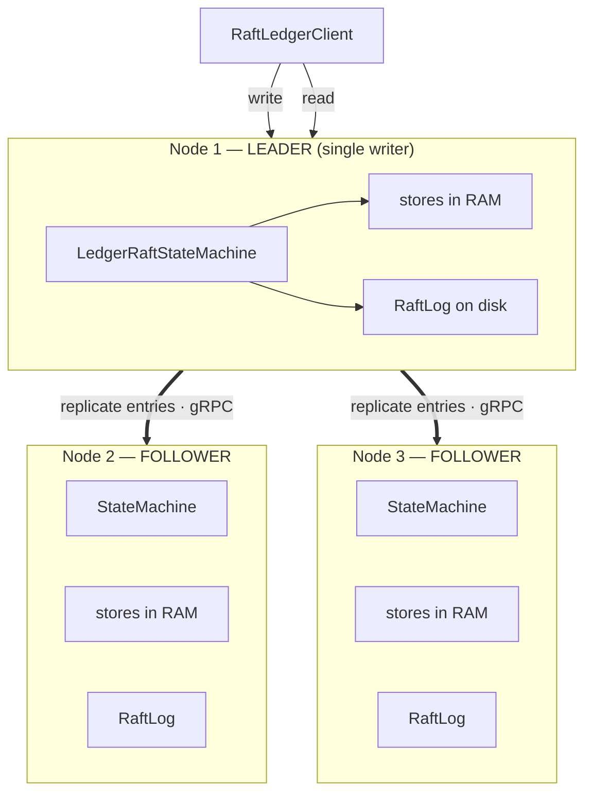
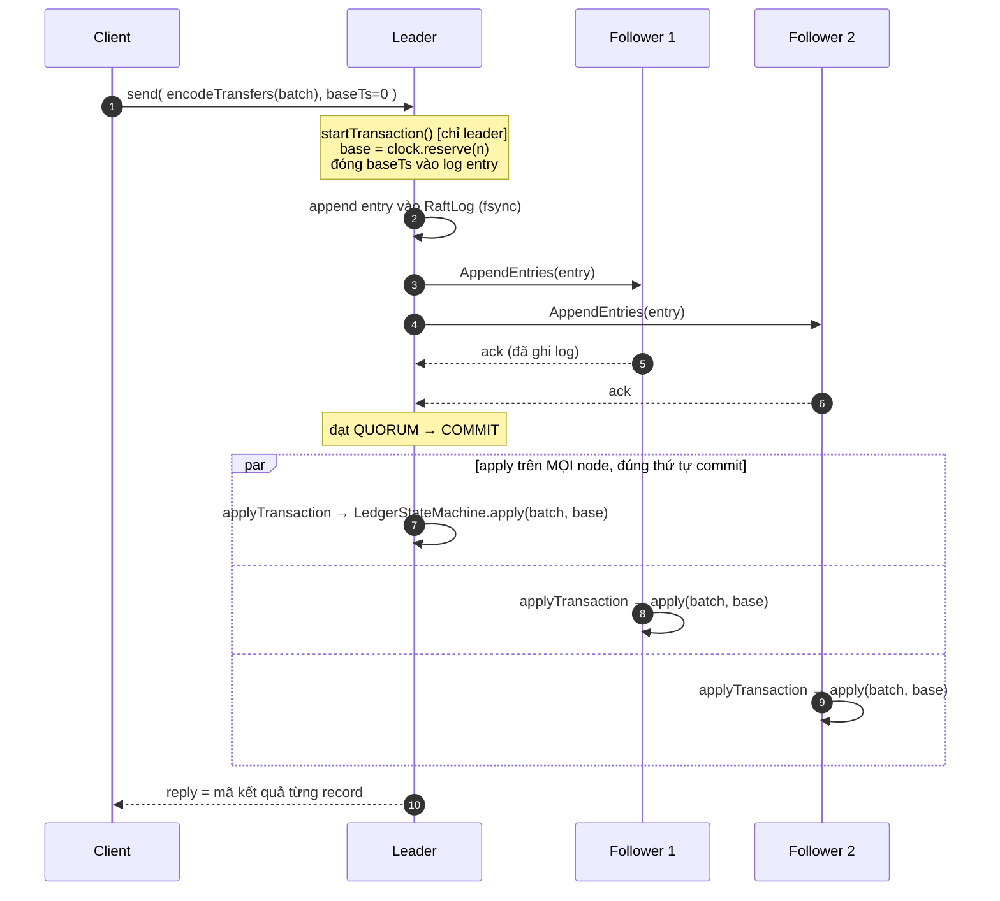
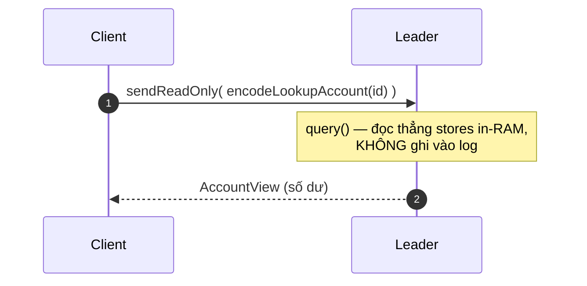
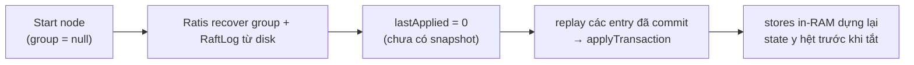
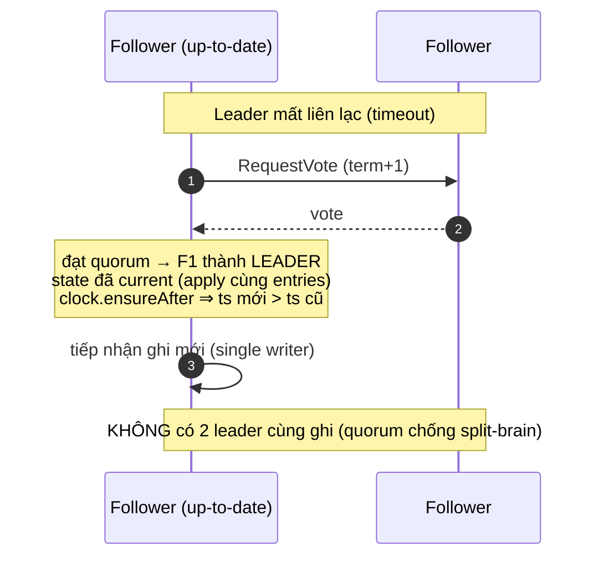

# High availability — Raft active-passive (đã implement)

Mô tả cơ chế replication **đã code** trong package `com.payments.ledger.raft`
(Apache Ratis 3.1.0, gRPC). Mô hình: **active-passive** — một leader là writer
duy nhất, follower replay cùng log để giữ state giống hệt; leader chết thì bầu
follower lên thay.

> Ánh xạ với mô hình cũ: **RaftLog thay Journal+Disruptor** trên đường ghi;
> `applyTransaction` chính là **điểm mutate duy nhất** (single-writer, nay
> replicated). Tái dùng nguyên `LedgerStateMachine` + stores + enum kết quả.

## 1. Topology

## 2. Đường GHI (write) — `client.io().send(...)`

Điểm cốt lõi:
- **base timestamp** do leader cấp ở `startTransaction` rồi **nằm trong log** ⇒ mọi node tính `ts = base + index` giống hệt (không đọc wall clock).
- Command chỉ trả về client **sau khi commit** (quorum đã ghi log) — tương tự "fsync trước khi báo OK" của bản single-node, nay là "replicated trước khi báo OK".
- `applyTransaction` còn gọi `clock.ensureAfter(base+n-1)` trên **mọi** node.

## 3. Đường ĐỌC (read) — `client.io().sendReadOnly(...)`

## 4. Recovery khi restart — replay RaftLog

Hiện chưa tích hợp snapshot LSM ⇒ recovery = **replay toàn bộ log đã commit** (đã test: tắt node → bật lại → số dư khôi phục đúng).

## 5. Failover khi leader chết (đã test 3-node)

## 6. Ánh xạ code ↔ khái niệm Raft

| Khái niệm Raft | Trong code |
|---|---|
| Replicated log entry | command `[op][baseTs][payload]` ([LedgerCommandCodec](../src/main/java/com/payments/ledger/raft/LedgerCommandCodec.java)) |
| State machine apply | `applyTransaction` → `LedgerStateMachine.apply` ([LedgerRaftStateMachine](../src/main/java/com/payments/ledger/raft/LedgerRaftStateMachine.java)) |
| Gán dữ liệu trước khi replicate (leader) | `startTransaction` (reserve + stamp base ts) |
| Read-only query | `query()` đọc stores in-RAM |
| Server/transport | `RaftServer` gRPC ([RaftLedgerServer](../src/main/java/com/payments/ledger/raft/RaftLedgerServer.java)) |
| Client | `RaftClient` ([RaftLedgerClient](../src/main/java/com/payments/ledger/raft/RaftLedgerClient.java)) |
| Bootstrap vs recover | `setGroup(group)` lần đầu; `group=null` khi restart |

## 7. Trạng thái

- ✅ Đã test 1-node: write replicate→apply, read, idempotency, restart-recovery bằng replay log ([RaftReplicationTest](../src/test/java/com/payments/ledger/raft/RaftReplicationTest.java)).
- ✅ Đã test **failover 3-node**: ghi committed → giết leader → cụm bầu leader mới → state committed sống sót, retry cùng id ra `EXISTS` (không double-apply / không transfer ma), tiếp tục ghi được ([RaftFailoverTest](../src/test/java/com/payments/ledger/raft/RaftFailoverTest.java)).
- ⏳ Chưa tích hợp **snapshot + purge RaftLog** (log grow vô hạn — giống backlog journal-truncation).
- ⏳ Chưa wire vào Spring/HTTP (module opt-in).
